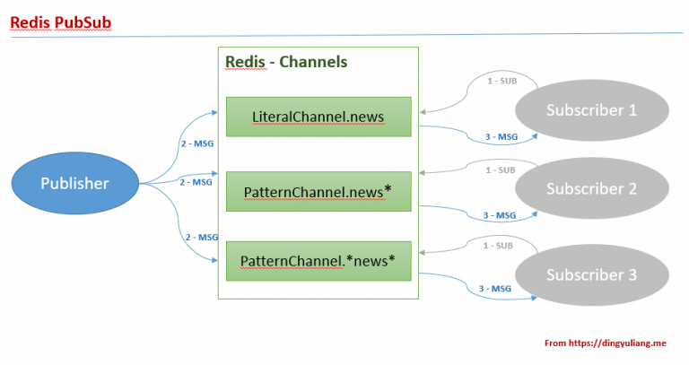

# What's New With 2.0.0

Version 2 is a major rewrite of our Java Extension.  You can find the release notes and the major areas of improvement here.

## Major Updates

### Redis Cluster Support

.png>)

We have added the capability to connect to not only standalone Redis instances via our `Redis Cache` connector, but we have introduced now the `Redis Cluster Cache` connector.  This connector can connect to any Redis Cluster and give you all the great features our extension gives.


### Redis Cluster Functions

We have also introduced several new functions for usage in a cluster cache:

| Function                            | Description                                                                                                    |
| ----------------------------------- | -------------------------------------------------------------------------------------------------------------- |
| `RedisGetCluster( cacheName )`      | Get access to the underlying Redis Cluster Java class so you can execute native cluster commands.              |
| `RedisGetClusterNodes( cacheName )` | Returns a struct of all the nodes and their appropriate Java classes representing their node connection pools. |

### Redis Pub/Sub



We have introduced the capability for your CFML code to now leverage Redis Publish and Subscribe constructs.  This will allow your CFML code to have native messaging via Redis.


Documentation


#### What is Pub/Sub?

> Redis Pub/Sub implement the Publish/Subscribe messaging paradigm. This decoupling of publishers and subscribers can allow for greater scalability and a more dynamic network topology.

1. Subscribers express interest in one or more channels (literal channels or pattern channels).
2. Publishers send messages into channels.
3. Redis will push these messages into different subscribers which have matched the channel's message.

#### Pub/Sub Functions

In order to leverage this pattern you will use the following two functions:

| Function                                            | Description                                                                  |
| --------------------------------------------------- | ---------------------------------------------------------------------------- |
| `RedisPublish( channel, message, cacheName )`       | Publish a message into redis into a specific channel.                        |
| `RedisSubscribe( subscriber, channels, cacheName )` | Subscribe to a channel for messages using a closure/lambda or a listener CFC |

#### Publish Example

```javascript
// Publish Example
<h2>Publishing messages...</h2>
<cfflush>
<cfscript>
	RedisPublish( "test-channel", "Hola mi amigo" );
	RedisPublish( "test-channel", "Hola mi amigo2" );
	RedisPublish( "test-channel", "Hola mi amigo Redis" );
</cfscript>
<h2>Finished publishing messages</h2>
```

#### Subscribe Example

```javascript
<cfscript>
// Subscribe with closure
closureSubscriber = redisSubscribe( ( channel, message ) => {
	writeDump( var="Message received on channel #arguments.channel#, #arguments.message#", output="console" );
}, "test-channel" );

// Subscribe with CFC
cfcSubscriber = redisSubscribe( new Subscriber(), "test-channel" );

</cfscript>
<h1>Subscription started!! Check the logs!</h1>
```

#### Subscriber Listener CFC

```javascript
component {

	public void function onMessage( String channel, String message ) {
		writeDump( var="Subscriber CFC -> onMessage called :#arguments.toString()#", output="console" );
	}

	public void function onPMessage( String pattern, String channel, String message ) {
		writeDump( var="Subscriber CFC -> onPMessage called :#arguments.toString()#", output="console" );
	}

	public void function onSubscribe( String channel, numeric subscribedChannels ) {
		writeDump( var="Subscriber CFC -> onSubscribe called :#arguments.toString()#", output="console" );
	}

	public void function onUnsubscribe( String channel, numeric subscribedChannels ) {
		writeDump( var="Subscriber CFC -> onUnsubscribe called :#arguments.toString()#", output="console" );
	}

	public void function onPUnsubscribe( String pattern, numeric subscribedChannels ) {
		writeDump( var="Subscriber CFC -> onPUnsubscribe called :#arguments.toString()#", output="console" );
	}

	public void function onPSubscribe( String pattern, numeric subscribedChannels ) {
		writeDump( var="Subscriber CFC -> onPSubscribe called :#arguments.toString()#", output="console" );
	}

}
```

### Code Quality

We have completely refactored our internal Java code to include code quality metrics via [SonarLint](whats-new-with-2.0.0.md#major-updates), upgrades to JDK 8-11 constructs, internal streams and so much more.

### Better Exception Handling

Dealing with exceptions is always nasty.  However, in this release we have optimized all exceptions so better debugging is added and we can pin point bugs and improvements.

## Release Notes

### Fixed

* [LRE-35](https://ortussolutions.atlassian.net/browse/LRE-35) cache filters for getting entries was not working
* [LRE-32](https://ortussolutions.atlassian.net/browse/LRE-32) getting all values/entries was not passing a built key, so return struct was always null
* [LRE-23](https://ortussolutions.atlassian.net/browse/LRE-23) LicenseHelper not validating all editions of similar product skus

### Added

* [LRE-27](https://ortussolutions.atlassian.net/browse/LRE-27) Update Jedis to 2.9.3
* [LRE-40](https://ortussolutions.atlassian.net/browse/LRE-40) Migration of docs to gitbook
* [LRE-39](https://ortussolutions.atlassian.net/browse/LRE-39) New redisSubscribe() so you can subscribe with closures/lambdas or CFCs to listen to Redis messages
* [LRE-38](https://ortussolutions.atlassian.net/browse/LRE-38) New redisPublish() UDF so you can publish messages into the Redis cluster
* [LRE-37](https://ortussolutions.atlassian.net/browse/LRE-37) New UDF redisGetClusterNodes() to get a map of cluster node objects
* [LRE-36](https://ortussolutions.atlassian.net/browse/LRE-36) Redis Cluster protocol support (RedisCluster, Sentinel, AWS, DigitalOcean)
* [LRE-33](https://ortussolutions.atlassian.net/browse/LRE-33) Redis publish and subscribe features
* [LRE-31](https://ortussolutions.atlassian.net/browse/LRE-31) New native cfml function: redisGetCluster() to get access to the native redis cluster manager
* [LRE-30](https://ortussolutions.atlassian.net/browse/LRE-30) Improve all exception handling to show exception messages
* [LRE-29](https://ortussolutions.atlassian.net/browse/LRE-29) Creation of a base class to share between cache implementations
* [LRE-28](https://ortussolutions.atlassian.net/browse/LRE-28) Add docker redis cluster support
* [LRE-25](https://ortussolutions.atlassian.net/browse/LRE-25) Allow for a new setting to allow for case-sensitive mode instead of case-insensitive mode (default)
